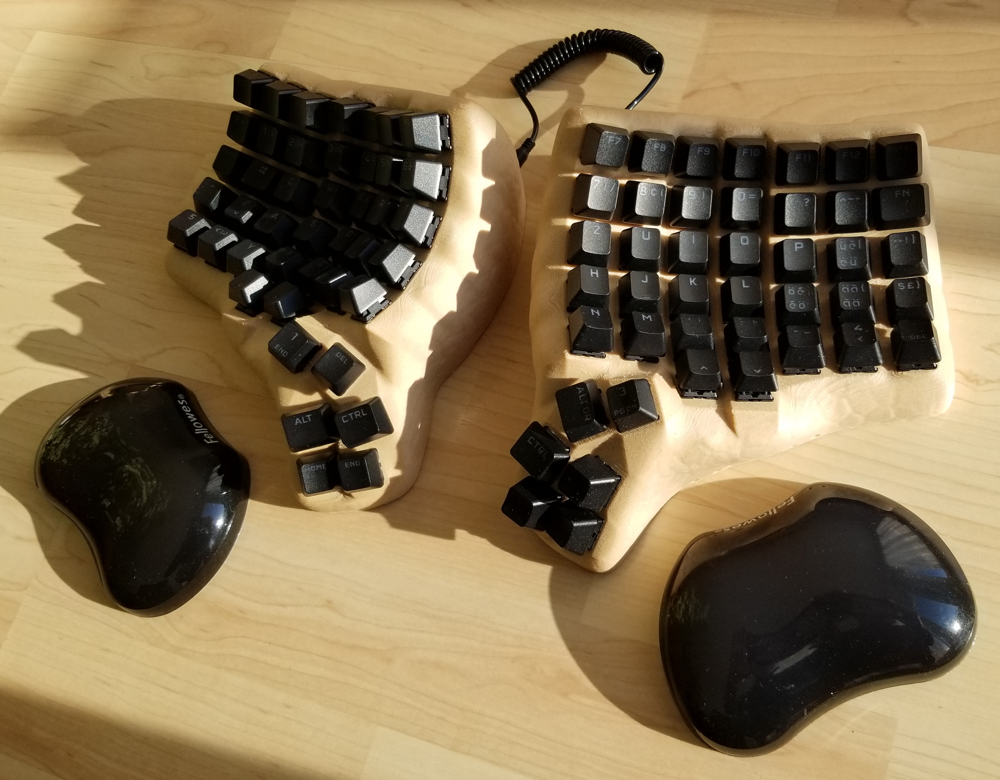

# Ixxoid Dactyl Manuform 6x7 Keyboard - Wooden Case
This is a fork of the [Dactyl](https://github.com/adereth/dactyl-keyboard), a parameterized, split-hand, concave, columnar, ergonomic keyboard.

My first Dactyl Manuform style Keyboard originally equipped with OEM Keycaps

Side view

Back view

Middle view

Back view

I switched to DSA keycaps, because the caps have all the same height, which makes sense on the curved key alignement. Since there are no DSA keycaps with swiss layout available, I use blank ones.

## Why did I design my own keyboard?

I used a Microsoft Sculpt ergonomic keyboard for the last couple of years. Then a few weeks ago the shift key stopped to work reliable. With the keyboard layout I use, I have to type shift-7 to enter a slash "/" which I need very often as I use Linux as OS.
So I had to replace my keyboard very quickly with something else. I ordered a Logitech ERGO K860 keyboard in a hurry.
But that keyboard needs way more space on my desktop as my former MS Sculpt TKL keyboard.
So I did some deeper research on the ergo keyboard topic and finally ended up with the wish to use a dactyl manuform keyboard, because this looked to fulfill my requirements the best.

## How did I create my keyboard?

#### Dactyl Generator

There are several Dactyl Manuform Case generators. They usually generate a STL file as output. 
Because I don't like the angular case design too much, I searched an alternative generator that produces a file format which is better editable than STL.
The only one I found is the following python 3 based generator which can output a STEP CAD file which is vector based and is generally the better choice for editing in a CAD system than STL.
https://github.com/joshreve/dactyl-keyboard
I just wanted to use the generator to create the "switch mounting matrix" of the surface and recreate the rest of the surface in the CAD. 

#### CAD modelling in Rhinoceros 3D (Rhino 3D)

This is the complete case which I had generated with the "dactyle keyboard generator" and then imported the STEP file into Rhnicoeros 3D as  a poly surface. Here with partially filled switch holes.

This is the top of the case after deleting the other parts, as poly surface geometry.

This are the boundarys of the key holes from the imported case in step format. They have the slots which allows the Cherry MX switches to snap in the case

The first try to generate a subd surface. The surface was converted from the imported step file to a mesh and then to a subd surface. The quality of the surface was not good enough for beeing usable. 

the converted surface has not a very good quality. Parts which should only be a simple rectangle, are splited into many sub surfaces.

There were also some holes in the model which couldn't be closed.

Therefore I had to redesign the complete surface. I used the SUBD mode in Rhino 3D, because this allows for a more organic surface design.

The redesigned top surfaces before joining the thumb cluster

The completely manually generated subd surface in the version from the 9th of July 2023 (the space for the keys might be not sufficient with a wall thickness of 5 mm..)

The completed surface with keycaps...

The final keyboard case after refining the surface in Z-Brush.  The picture is from rendering the model back in CAD

##### The Arduino mount 

The Arduino Pro micro mount is designed to hold the Arduino in place without any screws. 

The CAD model

The 3D printed mount with the Arduino

##### The SDDS mount

The CAD model of the SDDS mount

#### The case bottom with the anti slip feets

#### 3D Printing the case

During the print of the left case

The left half right after printing before cleaning up and with the supports not yet removed

#### Wiring

To help with wiring I decided to use a kind of "Amoeba" PCB's.
For the connection between the single PCB's I used some old varnish insulated copper wires. Before soldering the wires, I just burned the insulation with the soldering tip.
To make the switches easier to replace, I used Milmax sockets.

**Schematic:**

For wiring I used the schematics from here: 
https://github.com/tshort/dactyl-keyboard?tab=readme-ov-file

**The Arduino Pro Micro Pinout:**
https://deskthority.net/wiki/Arduino_Pro_Micro#Pinout

The Amoeba PCB's with soldered diodes, hot-plug sockets and wires

The PCB's before mounting on the Cherry MX switches

The wiring is finished 

The completed case without keycaps

#### QMK Firmware

The matrix column pins need to be configured in the file config.h.
In the same file, it can be defined which side shall act as master. In case you want to flash the right side for the first time you need to set the master accordingly. I started with the left side and didn't had to set the master. So the left side seems to be the default master.
When both sides are flashed, you need to connect the usb cable to the side which is configured as master, or you might get the both sides mixed up.

**keymap**
The keymaping is configured in the file keymap.h

Flash the Arduinos

`qmk flash -kb handwired/dactyl_manuform/6x7 -km ch-de`

**Used Parts:**

BOM:

Amoeba Single-Switch PCBs ([https://keeb.io/products/amoeba-single-switch-pcbs](https://keeb.io/products/amoeba-single-switch-pcbs))
Mill-Max Hotswap Sockets ([https://keeb.io/products/mill-max-hotswap-sockets](https://keeb.io/products/mill-max-hotswap-sockets))
Pro Micro (USB-C Version) - 5V/16MHz - Arduino-compatible ATmega32U4 ([https://keeb.io/products/pro-micro-usb-c-version-5v-16mhz-arduino-compatible-atmega32u4](https://keeb.io/products/pro-micro-usb-c-version-5v-16mhz-arduino-compatible-atmega32u4))
1N4148 Diodes ([https://keeb.io/products/1n4148-diodes](https://keeb.io/products/1n4148-diodes))
TRRS PJ-320A Jack - 3.5mm ([https://keeb.io/products/trrs-jack-3-5mm](https://keeb.io/products/trrs-jack-3-5mm))
TRRS Cable ([https://keeb.io/products/trrs-cable](https://keeb.io/products/trrs-cable))
SKUF Silicone Rubber Keyboard Feet (3M 9448A) ([https://keeb.io/products/skuf-silicone-rubber-keyboard-feet](https://keeb.io/products/skuf-silicone-rubber-keyboard-feet))

Copper Wire https://www.distrelec.ch/de/kupferdraht-05mm-o0-25mm-100g-dahrentrad-dasol-1x0-25-mm-hg/p/15517271
CHERRY MX3A-L1NN   CHERRY MX Silent Red (sold out)
Wood Fillament for the case
PETG like fillament for the Arduino & TRRS holders and the bottom plates.

**Links:**

Andi4000's build log was very inspiring for me, because it's one of the very few Dactyl Manuforms with a 6x7 layout:

Andi4000 6x7 Dactyl-ManuForm Fork  https://github.com/andi4000/dactyl-keyboard#firmware
